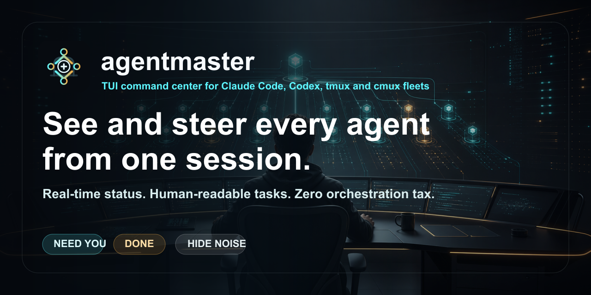

# agentmaster

**TUI command center for Claude Code, Codex, tmux and cmux agent fleets.**
agentmaster lets one human see and steer many coding agents from one terminal:
real-time status, human-readable task titles, transcript peeks, desktop alerts,
and zero orchestration tax.




## Why

Most multi-agent setups spend tokens asking an LLM orchestrator what is running,
blocked, done, or waiting. agentmaster removes that cost:

- **Observed state:** status is inferred from terminal output and cmux/tmux state.
- **Human routing:** the list floats `NEED YOU` work to the top.
- **On-disk coordination:** SQLite audit log, goals, seen-state and events.
- **Zero-token peeks:** transcript reads show last user, last assistant and next action.

## Highlights

- Dense list + detail view that scales to large fleets.
- Real cmux/tmux discovery on boot, plus native PTY agents.
- Live status updates from `cmux events` with polling as a backstop.
- Desktop notifications for `blocked` and `done` transitions (`N` toggles).
- Human task labels: noisy titles like `</task-notification>` are replaced with
  the transcript's first real prompt.
- `H` hide-noise mode removes stale idle rows and non-agent shell tabs.
- Ground-truth last-response ages from transcript mtimes where available.
- `focus`, `send`, `broadcast`, `goal`, `peek`, `ls --json` and session-restore
  helpers for headless workflows.

## Install

```bash
git clone https://github.com/Supersynergy/agentmaster.git
cd agentmaster
cargo build --release
./target/release/agentmaster --version
```

Optional local install:

```bash
install -m 0755 target/release/agentmaster ~/.local/bin/agentmaster
agentmaster doctor
```

Requires Rust 1.95+. macOS and Linux are the target environments.

## Quick Start

```bash
agentmaster doctor          # check data dir, PTY, runtimes, tmux/cmux
agentmaster                 # launch the TUI
agentmaster ls --json       # inspect discovered live agents headlessly
agentmaster peek <id>       # read transcript last-user/assistant/next
```

Inside the TUI, press `d` to discover again, `S` to cycle sort, `/` to filter,
`H` to hide noise, `f` to jump to the real cmux/tmux tab, and `?` for help.

## CLI

```bash
# See
agentmaster ls [--json]
agentmaster goals [--json]
agentmaster events -n 100
agentmaster peek <session-id>

# Steer
agentmaster send workspace:96 run the tests
agentmaster send dev:1.0 cargo nextest run
agentmaster broadcast "status?" --needs-input
agentmaster focus workspace:96

# Goals and fan-out
agentmaster goal payments-api ship checkout :: all e2e tests green
agentmaster batch tasks.md --yes
```

## Lean llmadapter ensembles

`ensemble` is an opt-in bridge for a small llmadapter swarm. AgentMaster stays
the controller: it gives every lane the same bounded task, saves each answer as
a private artifact, runs your oracle against answers one by one, and stops at
the first PASS. It does not aggregate, self-verify, or claim provider cost.
`llmadapter` must be executable on `PATH`; AgentMaster looks it up only when
this command is used.

Start with a dry-run. Local lanes are the default:

```bash
agentmaster ensemble fix-parser \
  --oracle 'cargo test -q parser_tests' \
  --dry-run \
  fix the parser regression
```

Execute only after checking that plan:

```bash
agentmaster ensemble fix-parser \
  --oracle 'cargo test -q parser_tests' \
  --go \
  fix the parser regression
```

Answers and usage stay under
`~/.agentmaster/ensembles/<name>/<run-id>/` with private permissions. The task
and llmadapter's raw JSON are never written there by the controller; a model
answer can still quote its input. A private `manifest.json` records only task
and answer hashes, policy, byte/deadline bounds, timings, oracle exit status,
artifact names, and final status. SQLite receives only status, SHA-256
fingerprints, and artifact paths.

`--max-tokens` accepts at most 500, but it is a requested output ceiling:
provider enforcement varies, especially for Ollama and CLI lanes. This is not a
hard token or cost budget. Independently, AgentMaster rejects adapter JSON over
1 MiB and the wall deadline defaults to 120 seconds. `--fresh` disables the
llmadapter cache.

Current llmadapter accepts the task only as a positional command-line argument,
not through stdin or a prompt file. The task can therefore be visible briefly
to same-host process inspection. Do not put secrets or PII in an ensemble task;
use a non-sensitive reference instead until llmadapter offers a private input
transport. `ATS_PII_SHIELD=1` is still forced for remote lanes, but it cannot
hide the local argv.

Remote selectors (`free`, `cli`) need `--allow-remote`. `paid` needs both
`--allow-remote` and `--allow-paid`. Named lanes and `all` require both flags
because v1 cannot prove a named lane's billing class:

```bash
agentmaster ensemble compare \
  --lanes free --allow-remote --fresh \
  --oracle './scripts/check-answer "$AGENTMASTER_ANSWER_PATH"' \
  --go \
  propose the smallest compatible patch
```

The oracle receives `AGENTMASTER_RUN_DIR`, `AGENTMASTER_ANSWER_PATH`, and
`AGENTMASTER_USAGE_PATH`. Its exit code is the decision: zero is PASS.

Reproducible zero-provider proof: the
[llmadapter payload benchmark](docs/LLMADAPTER-BENCHMARK.md) reduces a
constructed 4,000-line log payload from 184,497 to 852 bytes (99.5382%) after
local projection while preserving the executable oracle inputs. This is a
payload-capacity case study, not a provider-token, cost, quality, or end-to-end
latency claim.

## Keys

| Key | Action |
|-----|--------|
| `1` `2` `3` `4` | list / board / tree / logs |
| `j` `k` | move selection |
| `h` `l` | page in list or move lanes on board |
| `S` | cycle sort |
| `H` | hide stale/non-agent noise |
| `/` | filter by title, task label, last line or goal |
| `Enter` | inspect selected agent |
| `f` | jump to the real cmux/tmux tab |
| `s` | send a line |
| `g` | set goal + optional definition of done |
| `p` | refresh transcript peek |
| `N` | desktop notifications on/off |
| `d` | discover tmux panes + cmux workspaces |
| `q` | quit |

## Architecture

agentmaster is one Rust binary. Render is a pure function of application state;
mutation stays in `src/app.rs`.

```text
src/main.rs      CLI entry
src/app.rs       event loop, state transitions, cmux/tmux orchestration
src/ui.rs        ratatui rendering
src/fleet.rs     Agent, Status, Lane, Fleet
src/backend.rs   tmux + cmux adapters
src/peek.rs      transcript resolution + zero-token digest
src/store.rs     SQLite audit log, goals, seen-state
src/state.rs     output -> status/progress heuristics
src/pty.rs       native PTY backend
```

Docs:

- [SPEC](docs/SPEC.md)
- [Architecture ADR](docs/adr/0001-architecture.md)
- [TUI Best Practices ADR](docs/adr/0002-tui-best-practices.md)
- [Competitive Audit](docs/COMPETITIVE-AUDIT.md)
- [Changelog](CHANGELOG.md)

## Development

```bash
just setup
just check      # fmt check + clippy -D warnings + build
just ci         # doctor + check + tests + release build
```

Release gate used for v0.17.0:

```bash
cargo fmt --check
cargo nextest run
cargo clippy --all-targets --all-features -- -D warnings
cargo build --release
```

## License

MIT. See [LICENSE](LICENSE).
